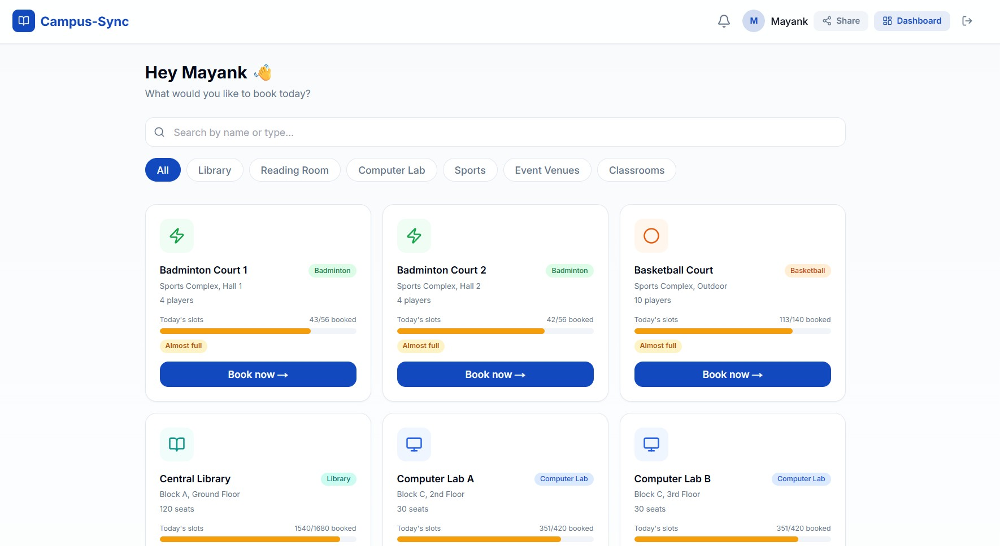

<h1 align="center">
  <br>
  🎓 Campus-Sync
  <br>
</h1>

<h4 align="center">A smart campus resource booking and management platform built for VIT Bhopal University.</h4>

<p align="center">
  <a href="https://campus-sync-nine.vercel.app">
    
  </a>
  
  
  
</p>

<p align="center">
  <a href="#-live-demo">Live Demo</a> •
  <a href="#-features">Features</a> •
  <a href="#-screenshots">Screenshots</a> •
  <a href="#-tech-stack">Tech Stack</a> •
  <a href="#-database-schema">Database</a> •
  <a href="#-setup">Setup</a>
</p>

---

## 🌐 Live Demo

**[https://campus-sync-nine.vercel.app](https://campus-sync-nine.vercel.app)**

> Sign in with your Google account. Contact the admin to get elevated permissions.

---

## ✨ Features

### 🟢 Student Features

| Feature | Description |
|---|---|
| **Resource Browsing** | Browse all campus resources — libraries, labs, courts, auditoria, and classrooms with real-time availability bars |
| **Smart Filtering** | Filter by type: Library, Reading Room, Computer Lab, Sports, Event Venues, Classrooms |
| **Slot Booking** | Pick any available hourly time slot and book instantly |
| **QR Code Tickets** | Each booking generates a unique QR code for check-in at the venue |
| **My Profile & History** | View upcoming bookings, cancel anytime (30 min before), see full booking history with status |
| **Usage Analytics** | Weekly bar charts, pie breakdown by resource type, and a personal time-preference heatmap |
| **Equipment Sharing** | Post requests for calculators, multimeters, etc. Other students respond with their email to connect |
| **Push Notifications** | Real-time in-app notifications for booking reminders and alerts |

### 🔴 Admin Features

| Feature | Description |
|---|---|
| **Admin Dashboard** | Campus-wide occupancy overview with live charts |
| **QR Scanner** | Scan student QR codes at venue entry/exit for check-in and check-out |
| **Booking Analytics** | Occupancy rates, peak hours, no-show tracking, cancellation alerts |
| **AI-driven Suggestions** | 7 actionable insights — dead slots, underutilised resources, peak demand windows |
| **Add New Resource** | Create any new bookable resource; 7-day slots auto-generated instantly |
| **Auto no-show cancel** | Bookings auto-cancelled after 10 minutes if student does not check in |

### 🏛️ Venues Available

**Academic Block 1** — Library, Reading Room, Audi 1 & 2, Rooms 023 / 025 / 503  
**Academic Block 2** — Library, Reading Room, Audi 1 & 2, Rooms 001 / 004  
**Block C** — Lab Complex, Lab Complex B  
**MPH** — Badminton Court 1 & 2, Volleyball Court  

---

## 📸 Screenshots

### Login Screen


### Student Homepage — Resource Grid


### Booking Screen


### Booking Confirmation & QR Code


### Venue Booking for Club Events


### Equipment Sharing (P2P)


### Admin Dashboard


### Admin Analytics


### AI Utilisation Suggestions


### QR Check-in / Check-out Panel


---

## 🛠 Tech Stack

| Layer | Technology |
|---|---|
| **Frontend** | Next.js 14 (App Router), React 18, TypeScript |
| **Styling** | Tailwind CSS, shadcn/ui components |
| **Charts** | Recharts |
| **QR Codes** | `qrcode.react`, `html5-qrcode` |
| **Backend / DB** | Supabase (PostgreSQL + Row Level Security) |
| **Auth** | Supabase Auth — Google OAuth |
| **Real-time** | Supabase Realtime (Postgres Changes) |
| **Edge Functions** | Supabase Edge Functions (Deno) for automated notifications |
| **Deployment** | Vercel (frontend) + Supabase (backend) |

---

## 🗄 Database Schema

```
users             — mirrors auth.users, stores role (student/admin), branch, semester
resources         — bookable venues: type, capacity, location, is_active
slots             — hourly time windows per resource per day (total_seats / booked_seats)
bookings          — student reservations: status, QR token, signed_in_at, signed_out_at
notifications     — per-user alerts and reminders
equipment_requests — P2P equipment borrow requests
equipment_comments — threaded replies on equipment requests
```

### Key Database Functions

| Function | Description |
|---|---|
| `handle_booking_seat_count()` | Trigger — auto increments/decrements `booked_seats` on booking status change |
| `handle_new_user()` | Trigger — auto-creates a `users` row on first Google sign-in |
| `auto_cancel_noshows()` | Marks active bookings as `no_show` if 10+ min past slot start with no check-in |
| `cancel_booking(p_booking_id, p_user_id)` | RPC — student-initiated cancellation with seat release |
| `is_admin()` | Helper — used in RLS policies to gate admin operations |

---

## 🚀 Setup

### Prerequisites

- Node.js 18+
- A [Supabase](https://supabase.com) project
- A [Google Cloud Console](https://console.cloud.google.com) OAuth app

### 1. Clone the repo

```bash
git clone https://github.com/mayankanand-dev/Campus-sync.git
cd Campus-sync
npm install
```

### 2. Environment variables

Copy `.env.local.example` to `.env.local` and fill in:

```env
NEXT_PUBLIC_SUPABASE_URL=https://your-project-ref.supabase.co
NEXT_PUBLIC_SUPABASE_ANON_KEY=your-anon-key
```

### 3. Set up the database

Run these SQL files **in order** in the Supabase SQL Editor:

```
supabase/migrations/001_init.sql      — Tables, triggers, RLS policies
supabase/migrations/002_rpc.sql       — Stored procedures (cancel_booking etc.)
supabase/seed.sql                     — Initial resource and booking data
supabase/migrations/004a_enum_values.sql  — New resource type enum values (run first)
supabase/migrations/004b_expansion_data.sql — New venues, rooms, equipment tables (run after 004a)
```

> ⚠️ Run `004a` and `004b` as **separate queries** — PostgreSQL requires new enum values to be committed before use.

### 4. Set up Google OAuth

1. Go to **Supabase → Authentication → Providers → Google**
2. Add your Google OAuth Client ID and Secret
3. Add `https://<your-ref>.supabase.co/auth/v1/callback` as an authorised redirect URI in Google Cloud Console

### 5. Run locally

```bash
npm run dev
```

Open [http://localhost:3000](http://localhost:3000)

### 6. Make yourself admin

In Supabase → Table Editor → `users` → find your row → set `role = admin`

---

## ⚙️ Auto No-Show Cancellation (Optional)

Schedule the auto-cancel function to run every 10 minutes using `pg_cron`:

```sql
SELECT cron.schedule('noshow-cancel', '*/10 * * * *', 'SELECT auto_cancel_noshows()');
```

---

## 📁 Project Structure

```
campus-sync/
├── app/
│   ├── (admin)/
│   │   ├── dashboard/     — Admin panel (analytics, QR scanner, add resource)
│   │   └── scanner/       — QR scan interface
│   ├── (auth)/
│   │   └── login/         — Google OAuth login page
│   └── (student)/
│       ├── home/          — Resource grid with filtering
│       ├── resource/[id]/ — Resource detail + slot picker
│       ├── booking/[id]/  — Booking detail + QR code
│       ├── profile/       — User stats, charts, booking history
│       └── share/         — P2P equipment sharing feed
├── components/
│   ├── booking/           — BookingCard, SlotPicker
│   ├── qr/                — QRGenerator, QRScanner, BookingQR
│   ├── notifications/     — NotificationBell
│   └── ui/                — shadcn/ui components
├── lib/
│   ├── supabase.ts        — Supabase client
│   ├── types.ts           — All TypeScript interfaces
│   ├── constants.ts       — Resource type labels and icons
│   └── utils.ts           — Helper utilities
├── supabase/
│   ├── migrations/        — SQL migration files
│   ├── functions/         — Edge Functions (check-occupancy, check-underutilization)
│   └── seed.sql           — Sample data
└── screenshots/           — UI screenshots for documentation
```

---

## 🔐 Access Control (Row Level Security)

All tables are protected by Supabase RLS:

- **Students** can only read/write their own bookings and notifications
- **Admins** have full access to all resources, slots, and bookings
- **Equipment requests/comments** are readable by all authenticated users, but only writable by the owner
- Edge Functions run with the **service role key** to bypass RLS for scheduled operations

---

## 👤 Author

**Mayank Anand** 
**Rohan chetty**
**Akhil prtap singh**
VIT Bhopal University  
[github.com/mayankanand-dev](https://github.com/mayankanand-dev)

---

<p align="center">Made with ❤️ for VIT Bhopal</p>
